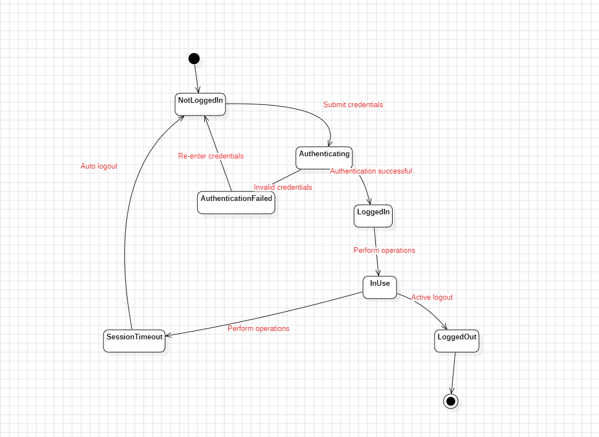
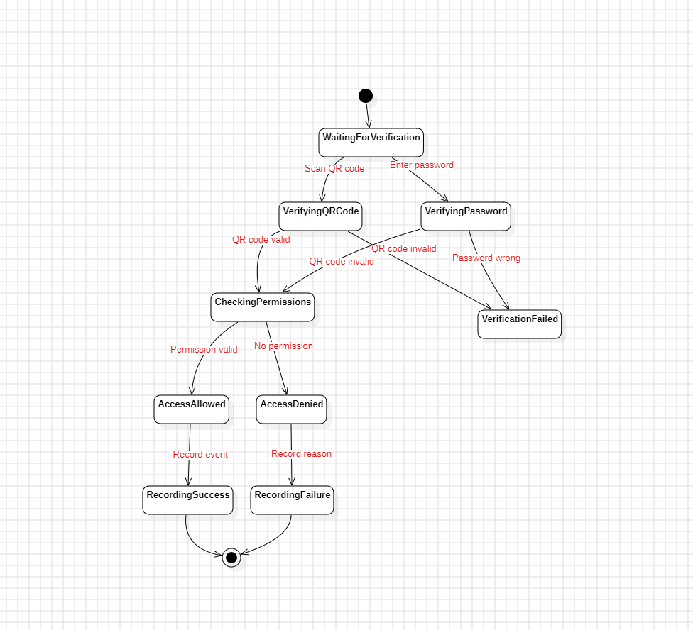

# System Diagrams

All diagrams used in this project are stored in the `docs/images` directory.
This page summarizes the key system diagrams used in the project documentation.

---

## 1. Level-0 Data Flow Diagram (DFD)

This diagram illustrates the highest level of system data flow.

---

## 2. Level-1 Data Flow Diagram

This diagram breaks down the main system modules into sub-processes.

---

## 3. Level-2 Data Flow Diagram

These diagrams provide a detailed view of the internal process logic.

### Level-2 (Part 1)

### Level-2 (Part 2)

---

## 4. Entity–Relationship Diagram (ERD)

This diagram describes the relational database model for the system.

---

## 5. State Transition Diagrams (STD)

These diagrams illustrate the state transitions for key system processes.

### STD Diagram 1

### STD Diagram 2

### STD Diagram 3

---

## Notes
- All diagrams are sourced from the requirements analysis and design stages.
- Image files are stored under `docs/images/`.
